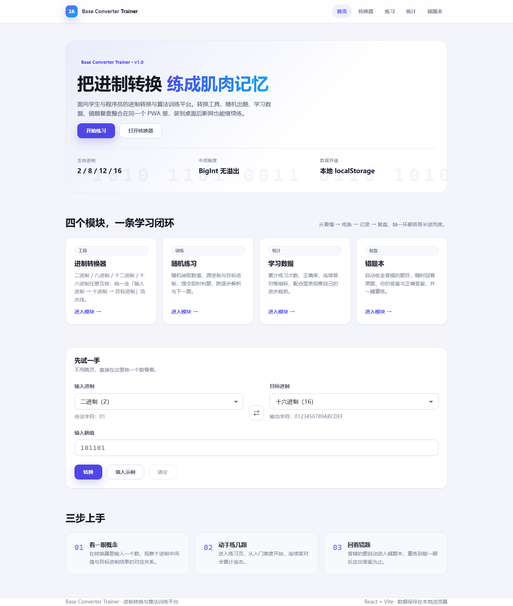
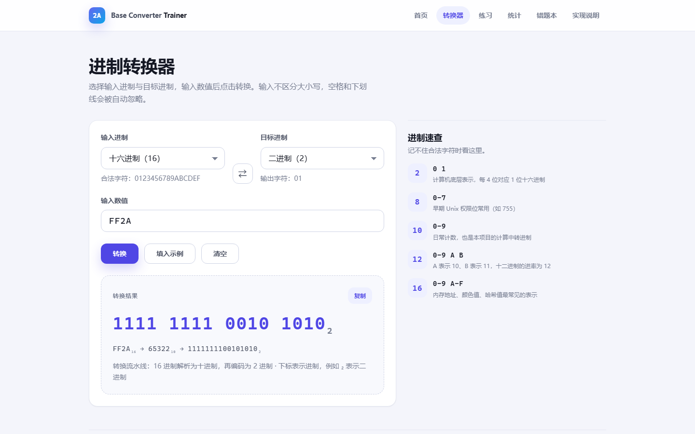
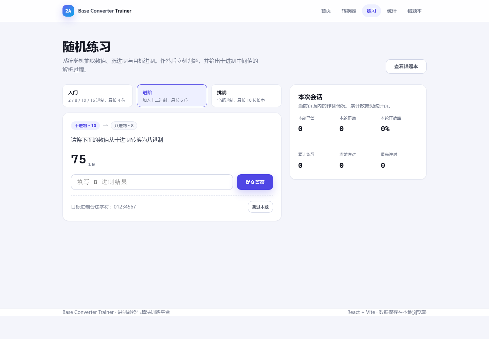
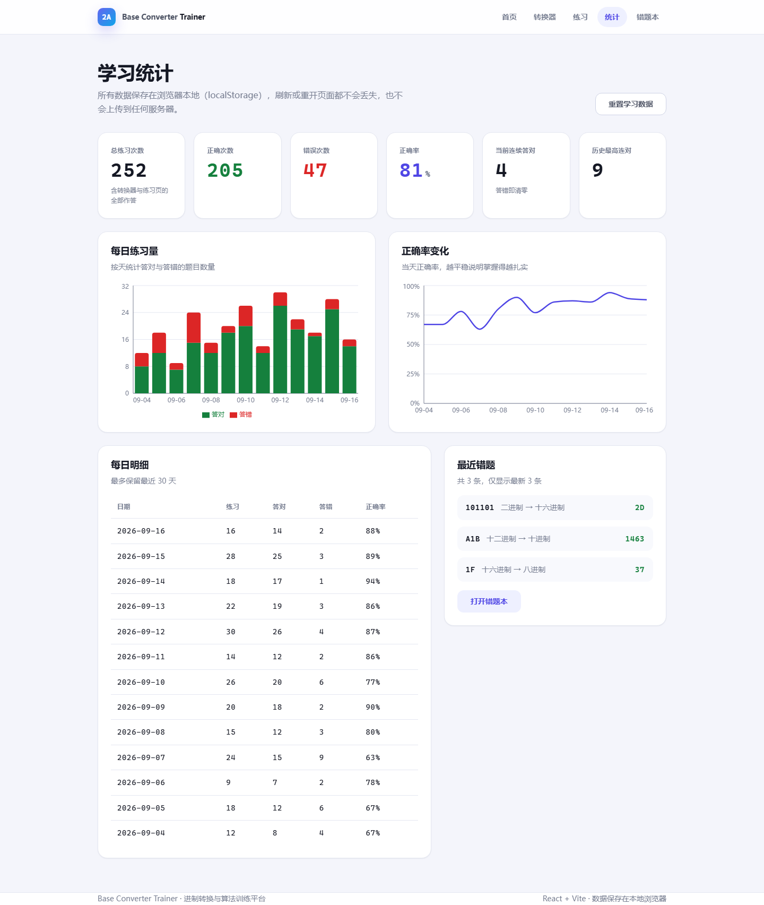
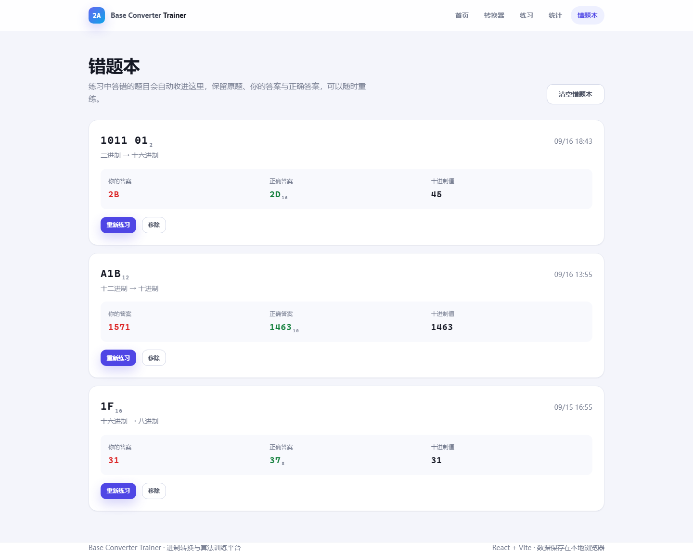
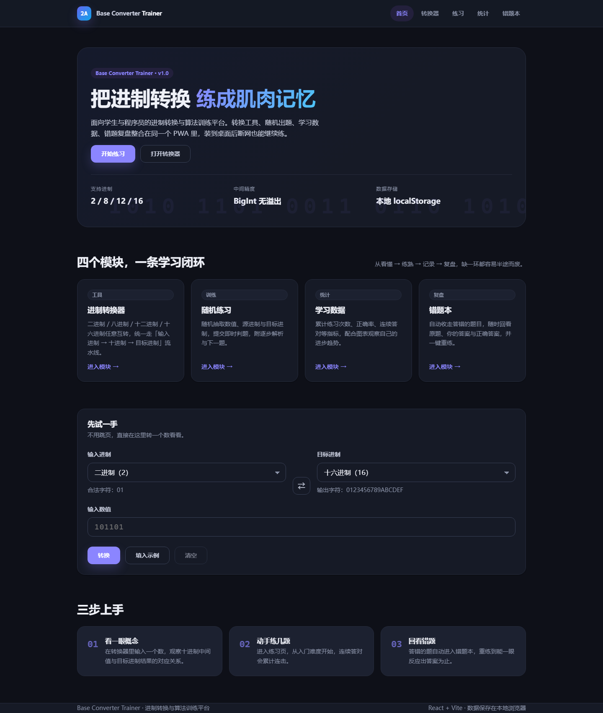

# Base Converter Trainer

> 面向学生与程序员的进制转换与算法训练平台 —— 把进制转换练成肌肉记忆。

[](https://react.dev/)
[](https://vitejs.dev/)
[](https://vitest.dev/)
[](https://web.dev/progressive-web-apps/)
[](./LICENSE)
[](https://github.com/FanMojun/base-converter-trainer/actions/workflows/deploy.yml)
[](https://fanmojun.github.io/base-converter-trainer/)

进制转换是一个「看懂只要五分钟，练熟要练一百题」的知识点。这个项目把**转换工具**、**随机出题**、**学习数据**、**错题复盘**放进同一个 PWA 里，形成一个能自我强化的练习闭环。

## 在线 Demo

**https://fanmojun.github.io/base-converter-trainer/**

无需安装，直接打开即可使用全部功能。支持手机浏览器访问，也可以「添加到主屏幕」当作 App 使用。

> 站点由 GitHub Actions 自动发布（见 `.github/workflows/deploy.yml`）：推送 `main` 后先跑
> `lint → test → build` 三道门禁，全绿才把 `dist/` 部署到 GitHub Pages。
> 因为 Pages 把站点挂在 `/<repo>/` 子路径下，构建时会注入 `VITE_BASE_PATH`，
> 并额外生成 `dist/404.html` 作为 SPA 深链接的回退页。

## 项目截图

| 首页 | 进制转换器 |
| --- | --- |
|  |  |

| 随机练习 | 学习统计 |
| --- | --- |
|  |  |

| 错题本 | 深色主题 |
| --- | --- |
|  |  |

## 功能特性

| 模块 | 说明 |
| --- | --- |
| **进制转换器** | 二进制 / 八进制 / 十二进制 / 十进制 / 十六进制任意互转；支持大小写混输、空格与下划线自动忽略；一键交换输入与目标进制；结果可复制 |
| **随机练习** | 随机生成数值 + 源进制 + 目标进制，三档难度（入门 / 进阶 / 挑战）；提交即时判题，附「源进制 → 十进制 → 目标进制」解析 |
| **学习统计** | 总转换次数、总练习次数、正确次数、错误次数、正确率、当前连对、历史最高连对；练习数据按天聚合 |
| **转换历史** | 转换器每次成功转换都会记录「输入值 → 结果」与所用进制；记录列表最多保留最近 50 条，统计页的**总次数不受这个上限影响**（单独计数）；重复提交同一组参数不会重复计数 |
| **数据可视化** | Recharts 每日练习量堆叠柱状图 + 正确率折线图，另有最近 30 天明细表 |
| **错题本** | 答错自动收录，保留原题 / 你的答案 / 正确答案 / 十进制值；支持一键重练、单条移除、清空（二次确认） |
| **PWA** | 可安装到桌面；安装后第一次访问就写入缓存，断网也能打开（见下方「PWA 与离线」的范围说明） |
| **响应式** | 桌面 / 平板 / 手机三档布局，导航在小屏折叠 |
| **主题** | 跟随系统明暗偏好自动切换，图表配色同步 |

## 技术栈与选型理由

| 选择 | 为什么是这个 |
| --- | --- |
| **React 18 + Context** | 各页面共用同一份学习数据，而写入来自多个入口（转换页、首页内嵌转换器、练习页）。把写入收口到 `StatsProvider` 一处，比每个页面各自读写 `localStorage` 更不容易出现口径不一致 |
| **Vite 5** | 开发态用原生 ESM，改样式即刻可见；构建时能把 react、图表库、统计页拆成独立文件，统计页的图表库不进首屏 |
| **JavaScript（不上 TypeScript）** | 数据处理的正确性集中在 `utils/` 的纯函数里，已由测试覆盖；类型注解无法覆盖「localStorage 里的数据是上一版本的」这类问题，那部分改由存储层的结构校验兜底（见设计要点 4） |
| **React Router 6** | 需要真实 URL —— 六个页面可分享、可前进后退，而不是靠组件状态切换 |
| **Recharts 2** | 声明式、跟 React 渲染模型一致；只在统计页用得到，因此单独拆包并懒加载 |
| **原生 CSS** | 样式规模只有三个文件，引入框架的收益不抵构建与心智成本；用 CSS 变量统一设计令牌，明暗主题只需换一组变量 |
| **Vitest 2 + jsdom + Testing Library** | 与 Vite 共用同一份配置和转换链，不需要额外配 babel/jest 映射；测试可以像用户那样点击、输入、切换进制，而不是只断言渲染出的字符串 |
| **原生 Service Worker + Manifest** | 离线策略只需要「导航网络优先 + 静态资源缓存优先」两条规则，手写比引入 Workbox 更容易讲清每条规则的来由和边界 |

## 快速开始

```bash
# 1. 安装依赖
npm install

# 2. 启动开发服务器（默认 http://localhost:5173）
npm run dev

# 3. 生产构建 + 本地预览（离线能力必须在生产产物下验证，开发态不注册 Service Worker）
npm run build
npm run preview
```

## 可用脚本

| 命令 | 作用 |
| --- | --- |
| `npm run dev` | 启动开发服务器，带 HMR |
| `npm run build` | 生产构建，输出到 `dist/` |
| `npm run preview` | 本地预览生产产物 |
| `npm test` | 运行全部测试（Vitest） |
| `npm run test:watch` | 监听模式运行测试 |
| `npm run lint` | ESLint 检查 |
| `npm run icons` | 重新生成 PWA 图标（手写 PNG 编码器，无需额外依赖） |

## 项目结构

```
src/
├── components/          # 可复用组件，样式与组件同目录
│   ├── AppShell.jsx     # 导航 + 路由出口 + 页脚（与 Router 解耦，便于测试）
│   ├── Navbar.jsx
│   ├── BaseSelect.jsx   # 进制选择器，转换页与练习页共用
│   ├── ConverterForm.jsx
│   ├── PracticeCard.jsx
│   ├── Statistics.jsx
│   └── ErrorBoundary.jsx # 路由级错误边界，页面崩了不影响外壳
├── pages/
│   ├── Home.jsx         # 首屏 + 内嵌转换器
│   ├── Converter.jsx
│   ├── Practice.jsx
│   ├── Dashboard.jsx    # 懒加载：唯一依赖图表库的页面
│   ├── Mistakes.jsx
│   └── Algorithm.jsx    # 懒加载：实现说明（BigInt 精度对比、转换流水线、边界情况）
├── utils/
│   ├── converter.js     # 进制转换引擎（纯函数，无 React 依赖）
│   ├── generator.js     # 出题与判题（纯函数）
│   └── format.js        # 展示格式化，错题本与转换历史共用
├── hooks/
│   ├── useStorage.js    # localStorage 封装：结构校验 + 异常回退 + 跨标签页同步
│   └── useStats.js
├── context/
│   ├── StatsContext.js  # Context、初始结构、结构校验、按天聚合等纯逻辑
│   └── StatsProvider.jsx
├── pwa/
│   └── registerServiceWorker.js
├── styles/
│   ├── tokens.css       # 设计令牌：颜色 / 间距 / 圆角 / 阴影
│   ├── base.css         # 重置 + 通用原子类
│   └── pages.css        # 页面级布局
└── tests/
    ├── setup.js              # jsdom 缺口的补齐 + jest-dom 匹配器
    ├── test-utils.jsx        # 渲染整棵应用、读写 localStorage、读取页面状态
    ├── converter.test.js     # 转换引擎（纯逻辑）
    ├── generator.test.js     # 出题与判题（纯逻辑）
    ├── app.test.jsx          # 路由与导航（真实点击）
    ├── algorithm-page.test.jsx
    ├── converter-page.test.jsx
    ├── practice-page.test.jsx
    ├── mistakes.test.jsx
    ├── dashboard.test.jsx
    ├── conversion-history.test.jsx
    ├── storage.test.jsx      # 存储层结构校验与坏数据兜底
    └── error-boundary.test.jsx
```

## 设计要点

### 1. 一套流水线，而不是 5×4 个转换函数

进制之间两两组合有 20 种方向（5 个进制、有向且不含自己转自己）。如果为每种组合单独实现，代码会迅速失控。因此所有转换都走同一条路径：

```
输入进制字符串 ──parseToDecimal──▶ 十进制 (BigInt) ──decimalToBase──▶ 目标进制字符串
```

- **中间值用 `BigInt`**，而不是 `Number`。`Number` 只有 53 位安全整数，64 位二进制串会静默丢精度；`BigInt` 可以精确处理任意长度。
- 底层只有两个函数（`parseToDecimal` / `decimalToBase`），上层 `convert()` 负责组合与错误处理。
- 输入校验与解析分离：`validateInput` 返回结构化结果不抛异常，供 UI 做实时提示；`parseToDecimal` 失败即中断，供业务逻辑使用。

### 2. 判题比较数值，而不是字符串

用户输入 `2d`、`2D`、`02D` 在语义上是同一件事。判题时统一规范化输入并比较解析后的数值，避免因大小写或前导零误判。

### 3. 状态写入收口到单一 Provider

练习页只负责「出题 / 显示 / 收集答案」，转换器只负责算出结果；统计、错题、转换历史的写入统一由 `StatsProvider` 完成（`recordAttempt` / `recordConversion`）。首页内嵌的转换器与独立的转换页共用同一个表单组件，因此两条入口写出来的数据结构一定一致。

**「练习次数」与「转换次数」是两个独立口径，刻意没有合并**：随手转一个数不等于做了一道题，把两者混在一起会让正确率失去意义。

### 4. 数据只存本地，且读出来先过一道校验

所有学习数据保存在 `localStorage`，不上传任何服务器，也无需登录。

但 `JSON.parse` 成功不代表数据可用：用户可能手改过，浏览器里也可能残留着上一个版本的结构。所以读取时会走一遍**结构校验**（`sanitizeStats` / `sanitizeMistakes` / `sanitizeConversions`），把数据收敛成当前版本期望的形状，收敛不了就回退到初始值 —— 宁可丢掉一份坏数据，也不要让统计页在渲染时炸掉。校验通过后，下游的写操作就不必再写 `Array.isArray(previous) ? previous : []` 这类防御代码，判断只存在于存储边界一处。

`useStorage` 另外处理了三件事：写入失败（隐私模式 / 配额满）不崩溃、监听 `storage` 事件实现多标签页同步（别的标签页清空数据时本页回到初始值，而不是把 `null` 写回去）、提供 `reset()`。

转换历史有一条去重规则：同一组「输入值 + 源进制 + 目标进制」重复提交（例如连点两次转换按钮）只刷新最近一条，不增加次数；把进制调换过来（16→2 变成 2→16）则算新的一次。

### 5. 首屏只装首屏需要的东西，页面崩了不牵连外壳

两个路由用 `React.lazy` + `Suspense` 拆了出去：

- **统计页** —— 图表库的 gzip 体积是首屏全部代码的 1.6 倍，而用户不一定会打开统计页；
- **实现说明页** —— 一页纯阅读的参考资料，多数人整个使用过程里都不会点开，没有理由让它在首屏占位。

首屏 JS 的 gzip 体积因此是约 66.2 KB（数字取自 `npm run build` 的输出，只统计 JS，口径与下方提交记录一致；首屏样式另有 5.3 KB）：

| 分包（gzip） | 首屏 | 何时加载 |
| --- | --- | --- |
| `react` 53.4 KB | 需要 | 首屏 |
| `index` 12.8 KB | 需要 | 首屏 |
| `charts` 105.6 KB | **不需要** | 进入统计页时 |
| `Dashboard` 2.9 KB | **不需要** | 进入统计页时 |
| `Algorithm` 3.7 KB | **不需要** | 进入实现说明页时 |

拆包本身不等于按需加载：`manualChunks` 只决定「怎么分文件」，静态 import 照样会被首屏一起下载，真正让分包延后的是 `React.lazy`。所以这部分在真实浏览器里核对过 —— 打开首页时只发起了 2 个 JS 请求（`index`、`react`），点击导航进入统计页才新增 `Dashboard` 与 `charts`，进入实现说明页才新增 `Algorithm`。

配合两个决定：

- **错误边界放在「路由出口」而不是最外层**。某个页面抛异常时，导航和页脚必须还活着，用户能点到别的页面去，而不是面对整片白屏。
- **错误边界按路由地址重置**（`key={pathname}`）。切换页面即自动恢复，不需要用户手动刷新。

这条边界不只是防渲染 bug。分包的加载失败会直接抛到路由出口 —— 发版换了 hash、离线时缓存里又没有对应分包，都会走到这个提示页，比白屏可解释得多（离线场景的实测结果见下文「PWA 与离线」）。

### 6. 错误提示面向使用者

错误码（`EMPTY_INPUT` / `INVALID_CHARACTERS` / `INVALID_BASE` / `UNSUPPORTED_SIGN`）与提示文案分离。提示会直接告诉用户「哪个字符不合法」以及「合法字符集是什么」，而不是只丢一个「输入无效」。

## 测试

```bash
npm test
```

```
 ✓ src/tests/converter.test.js           (33)
 ✓ src/tests/generator.test.js           (24)
 ✓ src/tests/conversion-history.test.jsx (20)
 ✓ src/tests/converter-page.test.jsx     (17)
 ✓ src/tests/storage.test.jsx            (16)
 ✓ src/tests/practice-page.test.jsx      (15)
 ✓ src/tests/error-boundary.test.jsx     (13)
 ✓ src/tests/algorithm-page.test.jsx     (11)
 ✓ src/tests/dashboard.test.jsx          (9)
 ✓ src/tests/app.test.jsx                (8)
 ✓ src/tests/mistakes.test.jsx           (8)

 Test Files  11 passed (11)
      Tests  174 passed (174)
```

测试分成两类，各管各的事：

**纯逻辑（`converter.test.js` / `generator.test.js`，57 项）**
不需要 DOM，直接断言函数输出。

- 全进制往返一致性：2 / 8 / 10 / 12 / 16 两两组合共 25 组，`A → B → A` 结果必须一致
- 大数精度：64 位全 1 二进制串转十进制与十六进制（`BigInt` 的存在理由）
- 十二进制的 `A=10` / `B=11` 边界
- 错误输入：空串、纯空白、非法字符、负数、不支持的进制，以及返回的错误码是否正确
- 出题约束：题面在源进制下合法、源与目标进制必然不同、难度对应的位数与进制池、题目 id 不重复
- 判题容错：大小写、前导零、空答案、目标进制非法字符

**真实交互（其余 117 项）**
用 `jsdom` + Testing Library 把整棵应用渲染出来，然后像用户那样操作：

- 在输入框打字、点「转换」、切换进制、点「交换」，然后断言页面上出现的结果
- 读取页面上真实的题目，自己算出正确答案再填进去，据此断言判题结果 —— 不依赖随机数种子
- 提交错误答案 → 断言错题本里真的多了一条 → 点「重新练习」→ 断言跳回练习页
- 断言写进 `localStorage` 的数据结构，而不只是屏幕上的数字
- 灌入损坏 / 缺字段 / 旧结构的数据，断言页面照常渲染且数据被修正
- 让某个页面在渲染时抛异常，断言导航栏还在、切到别的路由能自动恢复
- 通过 `vi.mock` 让练习页抛错，验证错误边界的集成行为

**一个仍然没覆盖的地方**（写在这里以免被误读成「全都测了」）：离线行为没有自动化测试。Service Worker 的生命周期在 `jsdom` 里跑不起来，这部分靠真实浏览器手工验证，结论记录在下面的「离线能力到什么程度」。

## PWA 与离线

- `public/manifest.webmanifest` 提供 `standalone` 显示模式与 any / maskable 图标
- `public/sw.js` 策略：页面导航**网络优先 + 缓存回退**，静态资源**缓存优先 + 后台更新**，只处理同源 GET 请求
- 构建时额外产出一份 `asset-manifest.json`（见 `vite.config.js` 里的 `buildAssetManifest`），列出全部 JS / CSS 的带 hash 文件名。Service Worker 安装时读它，把**所有分包**一起预缓存 —— 见下面「离线反而更难了」一节的由来
- 开发环境不注册 Service Worker（避免干扰 HMR），验证离线请使用 `npm run build && npm run preview`
- `npm run icons` 内置一个手写的最小 PNG 编码器生成图标，不需要 canvas / sharp 等原生依赖
- Manifest 与 Service Worker 内部一律使用**相对路径**，因此根路径部署与子路径部署（GitHub Pages 的 `/<repo>/`）共用同一份代码，不需要为了换部署位置改路径

### 离线能力到什么程度（实测，不是推测）

验证方式：真实 Chrome 打开构建产物 → 等 Service Worker 接管 → **清空浏览器 HTTP 缓存** → **把静态服务器关掉** → 强制绕过 HTTP 缓存重载页面。只有这样才能排除「其实是浏览器自带缓存在兜底」的假象。

> 顺带一个踩过的坑：只用 DevTools / CDP 的「Offline」开关测不准。它不一定作用到 Service Worker 自己发起的请求，于是断网重载「成功」了，其实是 Service Worker 照样联网把资源拿了回来。**把服务器真正停掉再刷新**，才是可信的断网测试。

结论（首次访问后立刻断网，五个页面逐个走一遍）：

| 场景 | 结果 |
| --- | --- |
| 打开首页 | ✅ 正常渲染 |
| 进入转换 / 练习 / 错题本 | ✅ 正常使用（数据本来就在 localStorage） |
| 进入统计页 / 实现说明页 | ✅ 正常渲染 |
| 刷新页面 | ✅ 外壳照常打开 |

### 离线反而更难了：拆包与预缓存的矛盾

按需加载还有个不显眼的代价。原先 Service Worker 只从 `index.html` 里读出它引用的文件来预缓存 —— 而懒加载页面的 chunk 根本不在 HTML 里出现。于是出现过这样一个真实的失败：

```
首次在线打开首页 → 关掉网络 → 点「统计」
→ Unable to preload CSS for /assets/Dashboard-*.css
```

联网点开过一次统计页，分包就进了缓存，之后离线也能进；但**第一次访问就断网的用户，会看到错误边界兜住的提示页**。拆出实现说明页之后，同样的问题又被复制了一份。

修法是让 Service Worker 从构建清单里取全量产物：`asset-manifest.json` 是构建时生成的，包含所有 JS / CSS 的带 hash 文件名，安装阶段一次性缓存完（本次实测首次访问后缓存 13 项，含三个懒加载分包）。HTML 解析那条路径保留着 —— `public/` 下的图标、清单文件不经过打包器，进不了产物清单，只能从 HTML 里取。

装上这个之后，上表的「进入统计页 / 实现说明页」才真的是 ✅。

失败时用户看到的是一个有解释的提示页而不是白屏 —— 错误边界会区分「离线未缓存」与「发版后旧资源失效」两种原因，这正是加上错误边界的实际收益。

## 浏览器支持

需要支持 ES2020+ 与 `BigInt` 的现代浏览器：Chrome / Edge 88+、Firefox 78+、Safari 14+。

## 开发提交记录

项目按真实开发节奏分阶段提交，每个阶段一件事，不做「一次性大提交」。

**第一轮：把功能做出来**

```
chore: initialize react project          # 工程骨架与样式体系
feat: implement base conversion engine   # 转换引擎 + 转换页
feat: add practice system                # 出题判题 + 错题本 + 存储层
feat: add statistics dashboard           # Recharts 可视化 + 明细表
feat: add PWA support                    # 安装能力 + 离线访问
test: add unit tests                     # 纯逻辑测试
docs: update README                      # 文档与截图
docs: add live demo link
ci: deploy to GitHub Pages               # Actions 自动发布 + 子路径适配
```

**第二轮：按代码审查的结论做工程优化**

这一轮的每一步都由一个具体问题驱动，而不是「感觉可以更好」：

```
test: add real interaction tests              # 原来的测试用 renderToString 断言字符串，
                                              # 改不动输入框、点不了按钮，等于没测交互
fix: sync statistics with converter feature   # 文档写了统计转换次数，实现里转换器却没记录，
                                              # 属于「说了没做」，补上并统一口径
refactor: optimize dashboard loading          # 首屏把 106 KB 的图表库也一起下载了，
                                              # 统计页改为懒加载，首屏 JS gzip 从约 171 KB 降到约 65 KB
fix: run CI on Node 22                        # jsdom 30 要求 Node ≥ 22.19，CI 用 Node 20 一直红
feat: add error boundary                      # 单个页面抛异常会让整页白屏
refactor: tidy storage layer and drop dead code  # 存储层补结构校验；清掉「写了但没人用」的导出
fix: make offline access actually work on first visit  # 真断网测试发现离线其实打不开，
                                                       # 此前看着能用是浏览器缓存在兜底
```

**第三轮：让项目看起来像人写的，而不是像生成的**

这一轮的目标不是加功能，是去掉「AI 味」并补上工程细节：

```
refactor: rewrite UI copy in plain engineering tone      # 清掉「练成肌肉记忆」「形成闭环」
                                                         # 这类营销腔，只留准确的功能描述
fix: keep the browser tab title in sync with the page heading  # 标题还写着旧的名字
refactor: break up card uniformity with document-style panels  # 33 处 .card 用同一套圆角+阴影，
                                                               # 读起来像模板；另立一族朴素面板
feat: add an implementation-notes page for the conversion engine  # 把 BigInt 精度、转换流水线、
                                                                  # 边界情况摊开讲，数字全部现场计算
fix: stop reporting the conversion record count as the total  # 记录列表有 50 条上限，超过之后
                                                              # 「总转换次数」就永远停在 50
```

## 未来优化方向

- **小数与负数支持**：扩展 `parseToDecimal` / `decimalToBase` 支持小数位与符号位
- **更多进制**：把字符集抽象成配置后，扩展到 3 / 5 / 32 / 36 进制成本很低
- **更多题型**：进制加减法、补码与反码、位运算练习
- **训练模式**：限时挑战、按进制专项训练、间隔重复（SRS）复习错题
- **数据导出**：导出错题与统计数据为 JSON / CSV，支持云端同步
- **可达性**：补充键盘导航细节与屏幕阅读器文案，目标 WCAG 2.1 AA
- **构建体积预算**：CI 里加一道产物体积检查，超限直接让流水线失败（现在只是能在日志里看到体积）
- **离线测试自动化**：目前离线能力靠手工跑真实浏览器验证，可以引入 Playwright 把它变成 CI 里的一步
- **预取**：鼠标悬停导航时预取统计页，消掉首次进入的那一下等待

## License

[MIT](./LICENSE)
